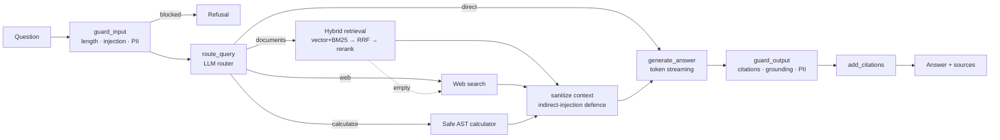

# 🔎 Agentic RAG Research Assistant

An agent that **routes each query** to document retrieval, web search, or a calculator, runs **hybrid retrieval (dense + BM25 → RRF → cross-encoder rerank)**, wraps the LLM in **input/output guardrails**, and returns **cited answers**. Ships with a **Streamlit UI**, a **FastAPI streaming API**, **Docker**, and a **RAGAS evaluation harness**.

**Stack:** Python · LangGraph · FAISS (or Chroma) · fastembed (ONNX) · FastAPI · Streamlit · Docker · RAGAS · Anthropic / OpenAI / Groq

## Architecture



## SOLID, mapped to the code

| Principle | Where |
|---|---|
| **S**ingle responsibility | One class per job: `loaders`, `RecursiveChunker`, `FaissVectorStore`, `BM25KeywordIndex`, `HybridRetriever`, `FastEmbedReranker`, each guardrail, `AnswerGenerator`, `AgentNodes`, `AgentService` |
| **O**pen/closed | New LLM provider → `register_provider()`; new retrieval strategy → one branch in `retrieval/factory.py`; new tool → add to the tools dict; new guardrail → append to the chain. No existing class is edited |
| **L**iskov | `VectorRetriever`, `HybridRetriever`, `RerankingRetriever` are interchangeable `Retriever`s; FAISS ↔ Chroma swap with one env var |
| **I**nterface segregation | Small `Protocol`s in `domain/interfaces.py` (`Embedder`, `Reranker`, `Retriever`, `Tool`, `Router`…) instead of one fat base class |
| **D**ependency inversion | Agent/nodes depend only on protocols; `container.py` is the single composition root that knows concrete classes. Tests inject fakes |

`RerankingRetriever` is a Decorator, `GuardrailChain` a Composite/Chain-of-Responsibility, `LLM_PROVIDERS` a registry.

## Guardrails (`src/rag_agent/guardrails`)

| Stage | Guardrail | Action |
|---|---|---|
| Input | Length / empty check | block |
| Input | Prompt-injection patterns | block |
| Input | PII redaction (email, phone, SSN, Luhn-valid cards, Aadhaar) | redact – PII never reaches the LLM |
| Input | LLM moderation *(optional)* | block |
| Retrieved text | `ContextSanitizer` – neutralises instructions hidden in docs/web pages | sanitise |
| Prompt | Context fenced as untrusted data, rules forbid following it | – |
| Output | Strip hallucinated `[n]` citations, warn on uncited answers | redact |
| Output | LLM grounding judge *(optional)* | block |
| Output | PII redaction | redact |

Turn the LLM-judge guards on with `LLM_GUARDRAILS_ENABLED=true` (adds latency + cost). Use `JUDGE_PROVIDER/JUDGE_MODEL` to judge with a different model than the generator.

## Quick start (local)

```bash
python -m venv .venv && source .venv/bin/activate        # Python 3.10–3.12
pip install -r requirements.txt
cp .env.example .env                                      # add ONE provider key

streamlit run streamlit_app.py                            # UI  -> http://localhost:8501
# or
PYTHONPATH=src uvicorn rag_agent.api.main:app --reload    # API -> http://localhost:8000/docs
```
First launch downloads two small ONNX models (~200 MB) and indexes `data/documents/`. Drop your own PDFs/MD/TXT in that folder (or upload in the UI) and run `python scripts/ingest.py --reset`.

### API
```bash
curl -N -X POST localhost:8000/query/stream -H 'Content-Type: application/json' \
  -d '{"question":"What is RRF?"}'
# data: {"type":"route","data":"documents"}
# data: {"type":"token","data":"Reciprocal "} ...
# data: {"type":"final","data":{"answer":"...","citations":[...],"guardrail_notes":[]}}
```
`POST /query` (non-streaming) · `POST /ingest` (multipart upload) · `GET /health`. Set `API_KEY` to require an `X-API-Key` header.
> The streamed text can be replaced by the `final` event if an output guardrail edits or blocks the answer – the Streamlit UI already does this.

## 🚀 Deploy on Streamlit Community Cloud

1. Push this folder to a **GitHub repo** (`.env` and `data/index` are git-ignored).
2. Go to **share.streamlit.io → Create app** → pick the repo/branch, **Main file path:** `streamlit_app.py`.
3. **Advanced settings →** Python **3.11**; paste into **Secrets**:
   ```toml
   LLM_PROVIDER = "anthropic"
   LLM_MODEL = "claude-haiku-4-5-20251001"
   ANTHROPIC_API_KEY = "sk-ant-..."
   ```
   (Groq has a free tier: `LLM_PROVIDER="groq"`, `LLM_MODEL="llama-3.3-70b-versatile"`, `GROQ_API_KEY=...`.)
4. Deploy. The app indexes `data/documents/` on first boot (~1–2 min incl. model download).

Notes: the free tier filesystem is ephemeral and the index is shared by all visitors – fine for a demo; for persistence use the Docker deployment with a volume. Chroma isn't in `requirements.txt` (SQLite version issues on Cloud) – FAISS is the default.

## Docker / Render / Railway / HF Spaces

```bash
docker compose up --build        # API :8000, Streamlit :8501
```
The image honours `$PORT` (Render/Railway). For **HF Spaces (Docker SDK)** set `app_port: 8501` and use the Streamlit command. Set your API key as a platform secret/env var.

## Evaluation (RAGAS) – get your real numbers

```bash
pip install -r requirements-extras.txt
python scripts/generate_testset.py --n 30        # or hand-write evaluation/test_set.json (12 samples included)
python scripts/evaluate.py --test-set evaluation/test_set.json
```
It evaluates **vector (baseline) vs hybrid vs hybrid_rerank** and prints hit-rate@k, MRR@k (free, no LLM), **faithfulness, answer relevancy, context precision/recall** (RAGAS), plus the **% improvement over the baseline** – exactly the numbers for your résumé. If RAGAS `answer_relevancy` errors with Anthropic (it requests multiple generations), set `JUDGE_PROVIDER=openai` + `JUDGE_MODEL=gpt-4o-mini`.

Iterate and re-run after changing `CHUNK_SIZE`, `CHUNK_OVERLAP`, `TOP_K`, `CANDIDATE_K`, or prompts in `agent/prompts.py`.

## Tests
```bash
pip install -r requirements-extras.txt && pytest -q     # 36 tests, no API key or model download needed
```

## Résumé bullets (fill the brackets from your own runs)
- Built an agent (LangGraph) that routes each query to document retrieval, web search, or a calculator and returns answers with source citations.
- Implemented hybrid retrieval (FAISS + BM25, RRF) with cross-encoder reranking over **[N]** chunks from **[M]** documents, improving **[answer relevancy / hit-rate@5]** by **[X%]** over vector-only baseline.
- Added input/output guardrails (prompt-injection, PII redaction, indirect-injection sanitising, citation + grounding checks).
- Evaluated with RAGAS on a **[30]**-question set (faithfulness **[X]**, answer relevancy **[X]**); iterated on chunk size, prompts, retrieval settings.
- Served via FastAPI (SSE streaming) + Streamlit UI, containerised with Docker, deployed on **Streamlit Community Cloud** (+ **[Render/HF Spaces]**).

Only claim numbers you actually measured.
